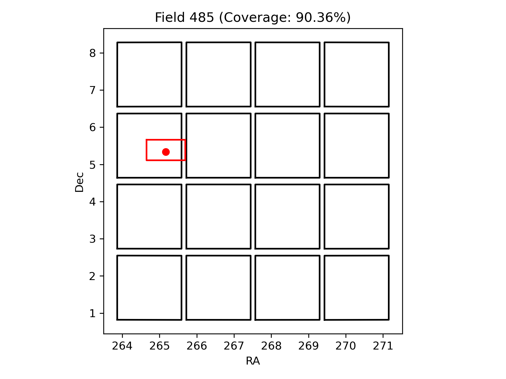

# ztf_plan_obs
Toolset for planning and triggering observations with ZTF. GCN parsing is currently only implemented for IceCube alerts.

It checks if the object is observable with a maximum airmass on a given date, plots the airmass vs. time, computes two optimal (minimal airmass at night) observations of 300s in g- and r and generate the ZTF field plots for all fields having a reference. There is also the option to create a longer (multiday) observation plan.

# Requirements
[ztfquery](https://github.com/mickaelrigault/ztfquery) for checking if fields have a reference.

ztf_plan_obs requires at least Python 3.7

# Installation
Using Pip: ```pip3 install ztf_plan_obs```.

Otherwise, you can clone the repository: ```git clone https://github.com/simeonreusch/ztf_plan_obs```. This also gives you access to the Slackbot.

# General usage
```python
from ztf_plan_obs.plan import PlanObservation

name = "testalert" # Name of the alert object
date = "2020-05-05" #This is optional, defaults to today
ra = 133.7
dec = 13.37

plan = PlanObservation(name=name, date=date, ra=ra, dec=dec)
plan.plot_target() # Plots the observing conditions
plan.request_ztf_fields() # Checks in which ZTF fields this 
# object is observable and generates plots for them.
```
The observation plot and the ZTF field plots will be located in the current directory/[name]


Note: Checking if fields have references requires ztfquery, which needs IPAC credentials.

# Usage for IceCube alerts
```python
from ztf_plan_obs.plan import PlanObservation

name = "IC201007A" # Name of the alert object
date = "2020-10-08" #This is optional, defaults to today
# Now no ra and dec values are given, but alertsource 
# is set to 'icecube'. This enables GCN archive parsing 
# for the alert name. If it is not found, it will use 
#the latest GCN notice (these are automated).

plan = PlanObservation(name=name, date=date, alertsource="icecube")
plan.plot_target() # Plots the observing conditions
plan.request_ztf_fields() # Checks in which ZTF fields 
# this object is observable and generates plots for them.
print(plan.recommended_field) # In case there is an error in the
# GCN, you will get the field with the most overlap here
```



# Triggering ZTF

`ztf_plan_obs` can be used for directly scheduling ToO observations with ZTF. 
This is done through API calls to the `Kowalski` system, managed by the kowalski python manager [penquins](https://github.com/dmitryduev/penquins).

To use this functionality, you must first configure the connection details. You need both an API token, and to know the address of the Kowalski host address. You can then set these as environment variables:

```bash
export KOWALSKI_HOST=something
export KOWALSKI_API_TOKEN=somethingelse
```

You can then import the Queue class for querying, submitting and deleting ToO triggers:

## Querying

```python
from ztf_plan_obs.api import Queue

q = Queue(user="yourname")

existing_too_requests = get_too_queues(names_only=True)
print(existing_too_requests)
```

## Submitting

```python
from ztf_plan_obs.api import Queue

trigger_name = "ToO_IC220513A_test"

# Instantiate the API connection
q = Queue(user="yourname")

# Add a trigger to the internal submission queue.
# If not specified otherwise, validity_window_end_mjd
# is computed from the exposure time

q.add_trigger_to_queue(
    trigger_name=trigger_name,
    validity_window_start_mjd=59719.309333333334,
    field_id=427,
    filter_id=1,
    exposure_time=300,
)

print(q.queue)
q.submit_queue()

# Now we verify that our trigger has been successfully submitted

existing_too_requests = get_too_queues(names_only=True)
print(existing_too_requests)
assert trigger_name in existing_too_requests
```

## Deleting
```python
from ztf_plan_obs.api import Queue

q = Queue(user="yourname")

trigger_name = "ToO_IC220513A_test"

res = delete_request(trigger_name=trigger_name)

# Now we check if it's gone
print(res)
```
